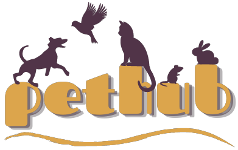

# **PetHub**




For All Your Pet Lovin' Needs

Visit [PetHub](https://cmwschroeder.github.io/pethub/)

## **Table Of Contents**
1. [Description](#description)
2. [Features](#features)
    - [Pet Finder](#pet-finder)
    - [Charities](#charities)
    - [Breed Info](#breed-information)
    - [Animal Facts](#animal-facts)
3. [Technologies Used](#technologies-used)
4. [Authors](#author)
5. [License](#license)

## **Description**

Pethub is a web app for anyone interested in responsibly adopting a pet. On our webapp you can find pets in all areas to adopt. Even if you do not want to make the committment yet in adopting an animal, but still want to contribute to animals in need, we have a charity page that brings you to charities in all locations. If you are unsure of where to donate, there is a recommended list of charities available and much more.

## **Features**

We have four main features on our site: 
* Pet Finder
* Charities
* Breed Information
* Animal Facts

### **Pet Finder**

The PetFinder feature is where our users will look for their future fur baby. To view this page you can click [here](https://cmwschroeder.github.io/pethub/pages/petFinder.html).


Pictured above you can see the mobile view of our pet finder feature. As you scroll you will be presented with animals who are looking for homes. Upon your initial visit the pag. If you would like to find a pet in a certain location, you should use the search form at the top of the page.


As pictured in the above animation, to choose which type of animal you would like to search for, you can choose options from a dropdown list. The option to add a location is also available, allowing users to enter their city and state or zip code to present results from within 100 miles of that location.

There is also a return to top button so the user can be brought back to the top of the page and adjust their search results if they would like.

### **Charities**

### **Breed Information**

### **Animal Facts**

The animal facts page is made for the last bit of convincing you may need to commit to adopting a new pet. In this section learn the fun and interesting things that pets do for us each day. After going through this carousel of facts and reading the creators of PetHubs testimonials to why we love and appreciate our pets, you will want to have one of your own!

PetHub Web App was developed with innovative technologies to make the layout and design appeal to a modern user. Animal facts page specifically was designed heavily with [daisyUI](https://daisyui.com/) and features from its parent [Tailwind CSS](https://tailwindcss.com/docs/installation). Animal Facts page has a carousel that displays facts of cats and dogs as you scroll through. The carousel was dynamically generated to present a different picture and fact as you scroll through the list. 
If you were to click from the starting picture, it will either scroll to the next fact and image, or it will scroll to the last page depending on the button clicked.
```
if(i === 0) {
            buttonLeft.attr("href", "#slide" + (animalFacts.length -1)); 
            buttonRight.attr("href", "#slide1")
```
If you are at the end of the carousel and you click the right button, it will go back to the start, and if you click the left button, it will just go back one.
```
 } else if (i === animalFacts.length -1) {
            buttonLeft.attr("href", "#slide" + (i - 1));
            buttonRight.attr("href", "#slide0");
```

The other significant features of this page was implementation of the Box Alignment feature, using [daisyUI](https://daisyui.com/). DaisyUI made it incredibly easy to align cards or text throughout the web app. The simple syntax made it easy to remember the code without having to scroll through documentation multiple times.
```
<section class="flex flex-wrap justify-center mt-6">
          <div class="card w-96 bg-base-100 shadow-xl justify-end mt-6">
```
The example above shows how the simple syntax for justifying an item to the center is: justify-center. The specifics for margin or height as well is: m-# or h-#. This simplified and shortened the code making it easier to go back and read.

Altogether, these new technologies made it easier to style the page and make it unique, but simple to navigate.


## **Technologies Used**
* [Tailwind CSS](https://tailwindcss.com/docs/installation)
* [daisyUI](https://daisyui.com/)
* [AniJS](https://anijs.github.io/)
* [PetFinder API](https://www.petfinder.com/developers/v2/docs/)
* [TheDogAPI](https://docs.thedogapi.com/)
* [Charity Navigator API](https://www.charitynavigator.org/index.cfm?bay=content.view&cpid=1397)

## **Author**
* [Joey Bennett](https://github.com/coderbennett)
* [Kylie Shinn](https://github.com/kyliemshinn/)
* [Krystopher Quintero](https://github.com/KrystopherQ)
* [Christian Schroeder](https://github.com/cmwschroeder)

## **License**
PetHub is available under the MIT license. For licensing details see [LICENSE](LICENSE.txt) document.